<p align = "center">
  
</p>

<p align = "center">
  <a href="#instalación" style="text-decoration: none;">
    
  </a>
  <a href="#manual-de-uso" style="text-decoration: none;">
    
  </a>
</p>

<p>
<picture>

</picture>
</p>

# Intro

**LUNEX** es un **Software** de escritorio desarrollado en **Python** que permite crear, visualizar y gestionar **modelos de regresión lineal simple y múltiple**. 

El software permite entrenar modelos, realizar predicciones, guardar y cargar modelos existentes, y ofrece una interfaz gráfica intuitiva para facilitar su uso.

# Objetivo del Proyecto

Este proyecto es parte de la asignatura de **Ingeniería de Software**. Trabajamos en equipo de 4 desarrolladores siguiendo la metodología **Scrum**, con sprints y user stories, y el profesor actúa como **Product Owner**.

El objetivo es aprender a desarrollar software de forma colaborativa, aplicando principios de desarrollo ágil, buenas prácticas de ingeniería de software, documentación clara y control de versiones con **Git** y **GitHub**.


# Tecnologías Utilizadas

- [Python](https://www.python.org): Lenguaje principal
- [CustomTkinter](https://customtkinter.tomschimansky.com): Interfaz gráfica moderna
- [Pandas](https://pandas.pydata.org): Análisis y manipulación de datos
- [Scikit-learn](https://scikit-learn.org/stable/): Modelos de machine learning
- [Matplotlib](https://matplotlib.org): Visualización de gráficos
- [Git](https://git-scm.com) + [GitHub](https://github.com/):  Control de versiones
- [Taiga](https://taiga.io/): Gestión del proyecto con Scrum

> [!NOTE]
>
> *Formatos de datos soportados**: CSV (.csv), Excel (.xlsx) y SQLite (.db)


# Instalación

## Requisitos Previos

  - Python 3
  - Dependencias listadas en `requirements.txt`
  - Fuente **Orbitron** (incluida en el proyecto)

  
## Instalación

### 1. Clonar el Repositorio
  
```bash
git clone https://github.com/tu-usuario/Lunex.git
cd lunex-datasets-loader
```

### 2. Instalar Dependencias 

```bash
pip install -r requirements.txt
```

### 3. Instalar la Fuente [Orbitron](https://fonts.google.com/specimen/Orbitron?preview.text=Datasets%20loader)

- La aplicación utiliza el font Orbitron. Los archivos del font se encuentran en la carpeta **Orbitron/**.

<p>
  <picture>
    
  </picture>
</p>

####  Windows

- Navega a la carpeta **`src\GUI\Orbitron`**
  
<p align = "center">
  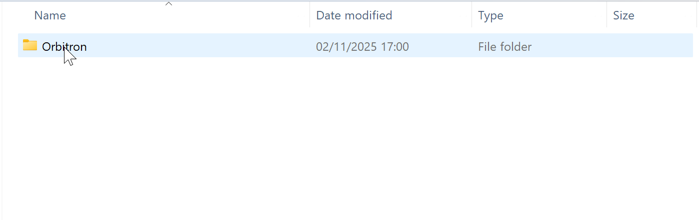
</p>

- Doble click sobre el fichero **Orbitron-VariableFont_wght.ttf**

<p align = "center">
  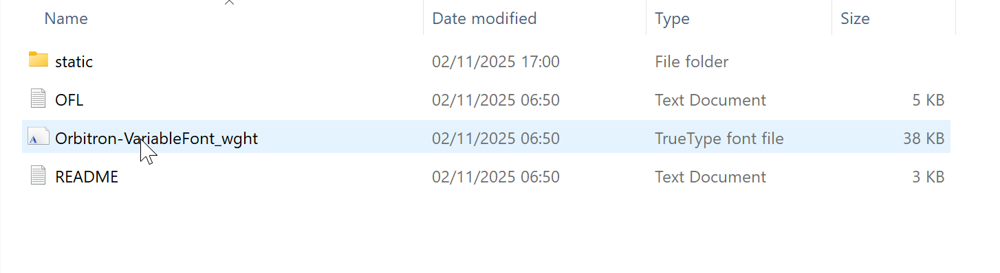
</p>

- Clic **instalar**

<p align = "center">
  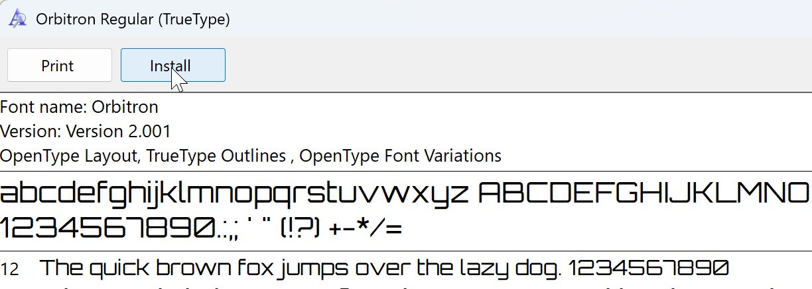
</p>

<p>
  <picture>
    
  </picture>
</p>

####  MacOS

- Navega a la carpeta **src/GUI/Orbitron**

<p align = "center">
  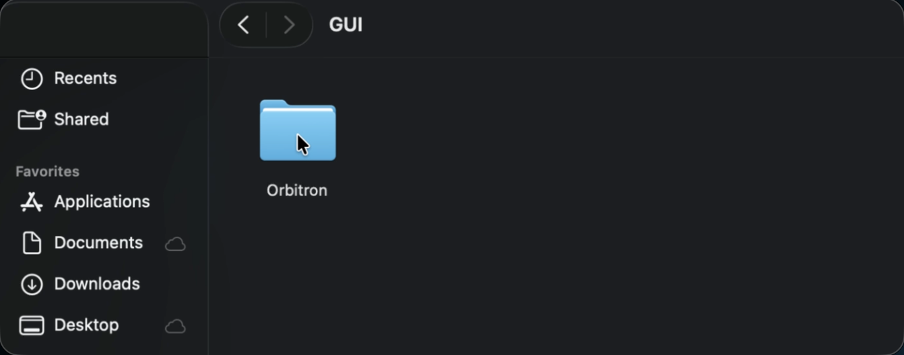
</p>

- Clic derecho sobre el ficehro **Orbitron-VariableFont_wght.ttf**

<p align = "center">
  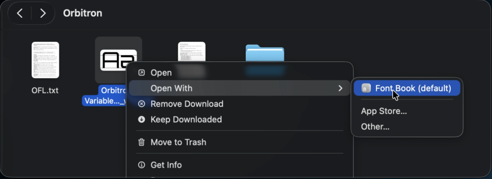
</p>

- Clic en **Instalar Fuente** en Font Book

<p align = "center">
  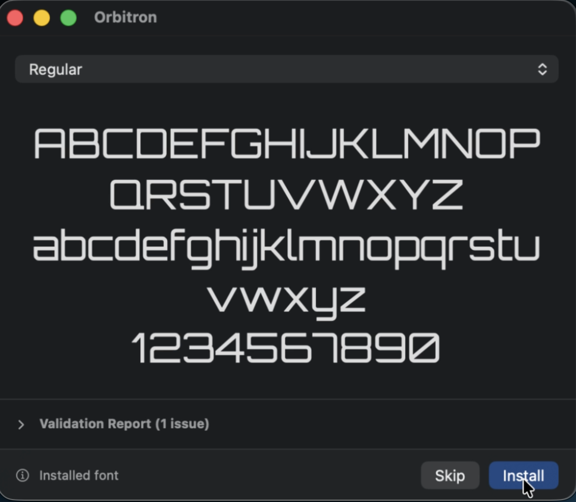
</p>

<p>
  <picture>
    
  </picture>
</p>

####  Linux

```bash
mkdir -p ~/.local/share/fonts
cp Orbitron/*.ttf ~/.local/share/fonts/
fc-cache -f -v
```

<p>
  <picture>
    
  </picture>
</p>

## Ejecutar El Software
```bash
cd src/
python main.py
```

<p>
  <picture>
    
  </picture>
</p>

<br>
<br>
<br>

<p align = "center">
  
</p>

# <p align="center">Manual de Uso</p>

## Pantalla Principal: Crear Modelo

<p align = "center">
  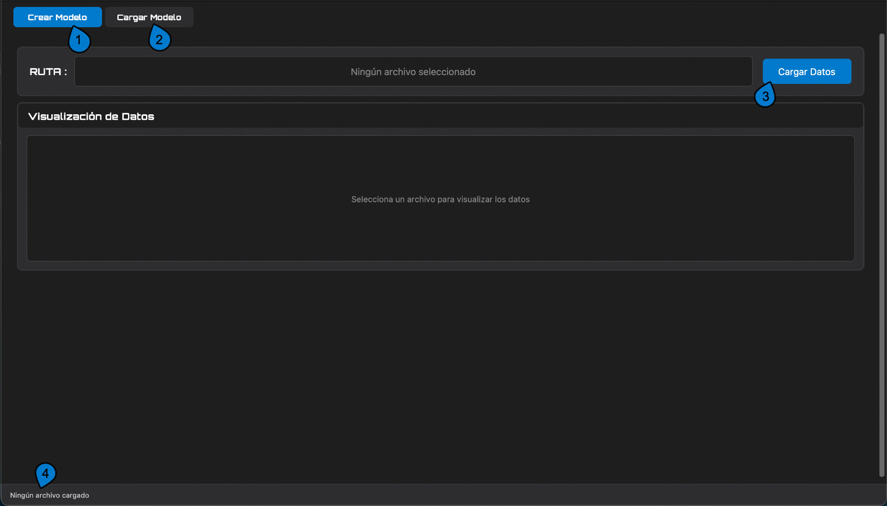
</p>

1. Pestaña **Crear Modelo**: Interfaz para crear y entrenar nuevos modelos de regresión
2. Pestaña **Cargar Modelo**: Interfaz para cargar modelos previamente guardados
3. Selecciona un archivo de dataset (CSV, Excel o SQLite)
4. Barra de informacíon del archivo cargado actualmente

<p>
  <picture>
    
  </picture>
</p>

## Selección y Preprocesamiento de Datos

<p align = "center">
  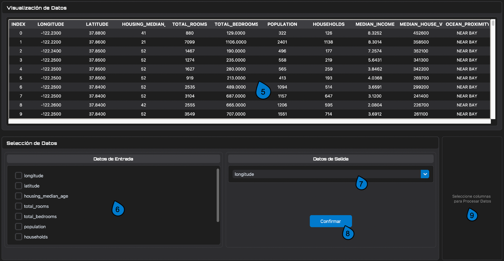
</p>

5. Tabla de visualización de las filas del dataset cargado
6. Selecciona las variables independientes (features) para el modelo
7. Selecciona la variable dependiente (target) a predecir
8. Confirma la selección de variables
9. Selecciona columnas para procesar

<p align = "center">
  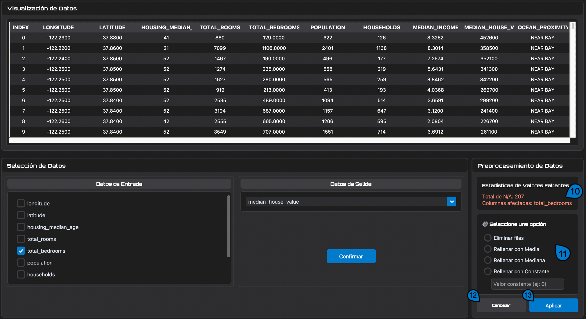
</p>

10. Estadísticas de valores faltantes: Muestra el total de NAs y columnas afectadas
11. Elige cómo manejar valores faltantes (eliminar filas, rellenar con media/mediana/constante)
12. Cancela el la opcion de preprocesamiento 
13. Aplicar cambios

<p>
  <picture>
    
  </picture>
</p>

## División de Datos y Entrenamiento

<p align = "center">
  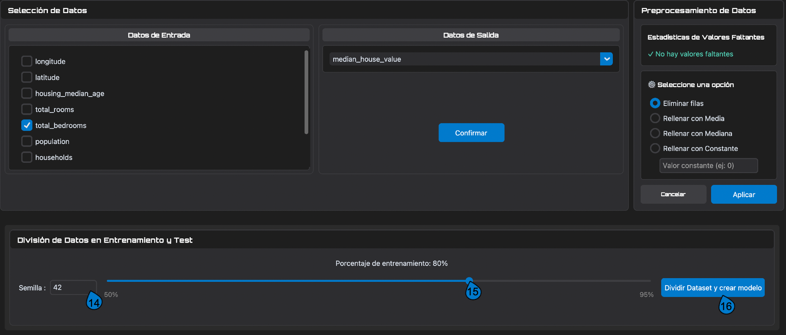
</p>

14. Elige el valor de la semilla aleatoria 
15. Ajusta el porcentaje de datos para entrenamiento (vs test)
16. Divide los datos y entrena el modelo de regresión lineal

<p>
  <picture>
    
  </picture>
</p>

## Evaluación del Modelo

<p align = "center">
  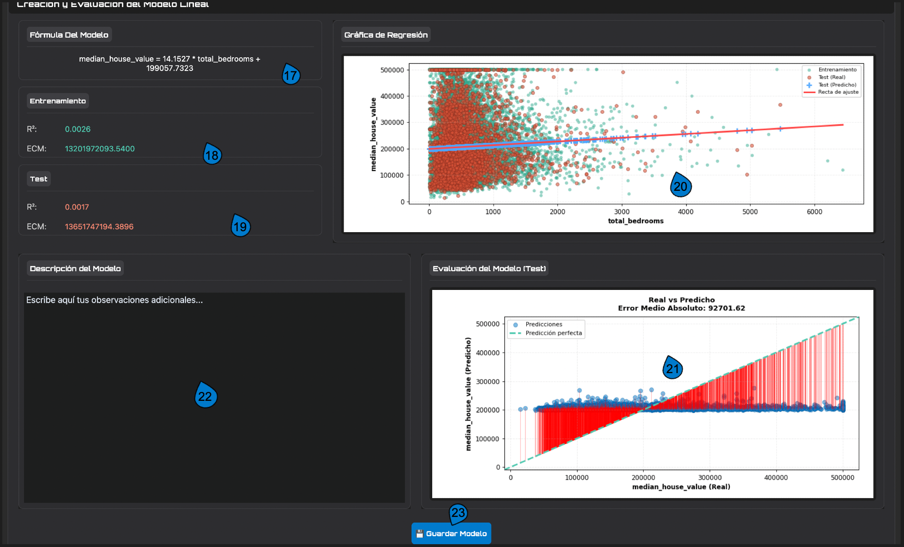
</p>


17. Fórmula del modelo: la ecuación de regresión lineal generada
18. Métricas de entrenamiento: Muestra R² y ECM del conjunto de entrenamiento
19. Métricas de test: Muestra R² y ECM del conjunto de prueba
20. Gráfico de regresión: Visualiza los datos de entrenamiento, test y la línea de ajuste
21. Gráfico Real vs Predicho: Compara valores reales con predicciones y muestra el Error Medio Absoluto
22. Campo de descripción: Añade observaciones o notas sobre el modelo
23. Guarda el modelo entrenado en formato .joblib

<p>
  <picture>
    
  </picture>
</p>

## Predicción con Modelo

<p align = "center">
  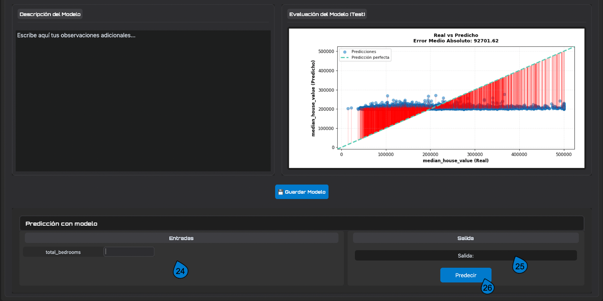
</p>


24. Ingresa valores para las variables independientes
25. Muestra el resultado de la predicción
26. Ejecuta la predicción con los valores ingresados

<p>
  <picture>
    
  </picture>
</p>

## Cargar Modelo Guardado

<p align = "center">
  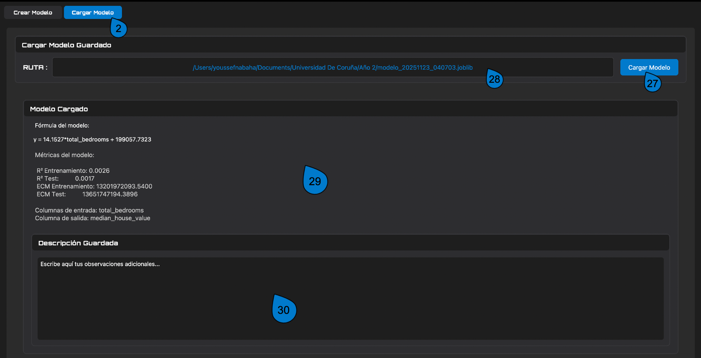
</p>


27. Selecciona un archivo .joblib para cargar un modelo guardado
28. Ruta del archivo del modelo cargado
29. Fórmula, métricas y características del modelo cargado
30. Descripción guardada: las observaciones que se guardaron con el modelo

<p>
  <picture>
    
  </picture>
</p>

**Equipo de desarrollo:** 

<p align="center">
  <a href="https://github.com/youssef-nabaha">
    
  </a>
  <a href="https://github.com/sarapazr04">
    
  </a>
  <a href="https://github.com/MohaElGX">
    
  </a>
  <a href="https://github.com/LCastroEx">
    
  </a>
</p>

**Scrum Master:** 
<p>
  <a href="https://github.com/sarapazr04">
    
  </a>
</p>

**Product Owner:** 

<p>
  <a href="https://github.com/aalvarell">
    
  </a>
</p>

<p align="center">
  <i>Made with ❤️ • Built with 🐍 • Powered by data & teamwork</i>
</p>
