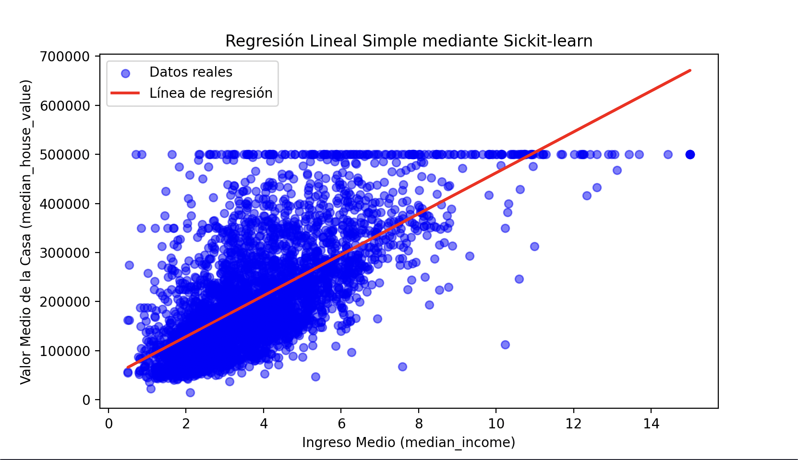
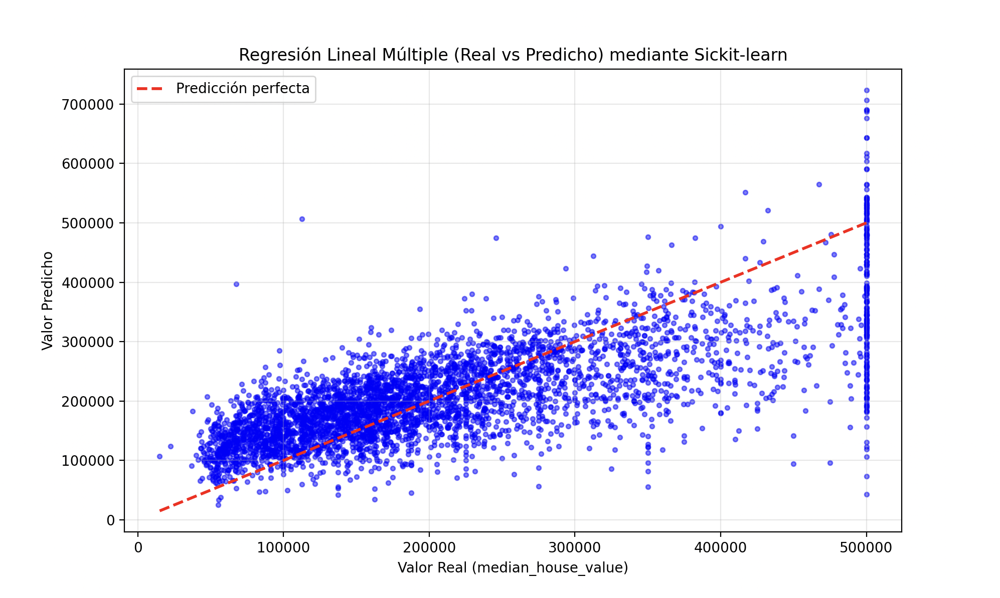
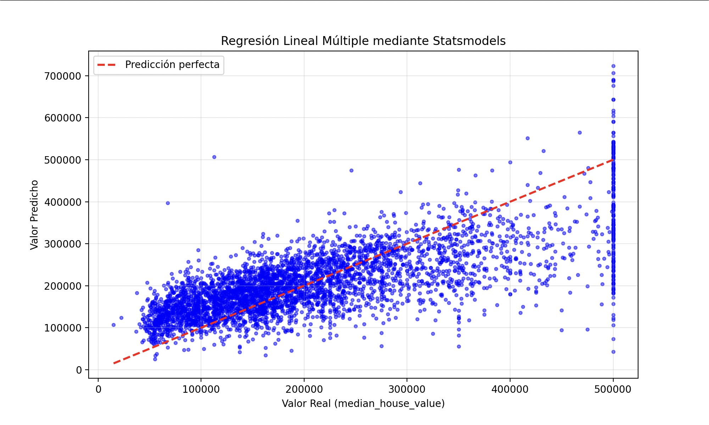

<h1 align = "center"> MODELO(S) REGRESIÓN LINEAL SIMPLE Y MÚLTIPLE </h1> 

<p align = "center">
  
</p>
<p align = "center">
  <a href = "https://github.com/youssef-nabaha">
    
  </a>
</p>

## ÍNDICE

1. **Conceptos Fundamentales:**
    - ¿Qué es un modelo en IA?
    - Origen de la regresión lineal
2. **Librerías Python:**
    - Scikit-learn
    - Statsmodels
    - TensorFlow
    - PyTorch
3. **Regresión Lineal Simple:**
    - Definición y ecuación
    - Métricas (MSE, R²)
    - Ejemplos con código
4. **Regresión Lineal Múltiple:**
    - Definición y ecuación
    - Interpretación de coeficientes
    - Ejemplos con código

5. **Referencias y Recursos:**

## 1. CONCEPTOS FUNDAMENTALES
### 1.1. ¿Qué es un Modelo en Inteligencia Artificial?

Un **modelo** en IA es simplemente una representación matemática que aprende patrones de los datos para realizar predicciones o tomar decisiones.

- **Definición formal**: 
> Un **modelo** es una función matemática **M** que mapea un conjunto de entradas **X** a un conjunto de salidas **Y** `M: X -> Y`.

- **Componentes de un modelo:**

  - **Parámetros:** valores que el modelo aprende (pesos, coeficientes)
  - **Hiperparámetros:** valores que nosotros definimos (tasa de aprendizaje, etc.)
  - **Función:** ecuación matemática que relaciona entrada y salida
  - **Algoritmo de entrenamiento:** método para ajustar los parámetros
  
- **Ejemplo concreto:**

Imagina que queremos predecir el **precio** de una casa. Nuestro modelo sería:
```
Entrada (X): área de la casa (m²)
Salida (Y): precio (euros)
Modelo: Y = a·X + b
Parámetros: a = 1500, b = 50000
```

Este modelo "aprendió" que cada `m²` vale **1500€** y que hay un precio base de **50000€**.

### 1.2. Origen de la Regresión Lineal
La **regresión lineal** fue desarrollada por **Carl Friedrich Gauss** a principios del siglo XIX (1809) para predecir la órbita de asteroides. El método se popularizó cuando **Adrien-Marie Legendre** publicó el método de los mínimos cuadrados en 1805.

- **¿Por qué se llama "regresión"?**

El término fue acuñado por **Francis Galton** en 1886 al estudiar la herencia de la altura. Observó que los hijos de padres muy altos tendían a ser más bajos que sus padres (regresaban hacia la media), fenómeno que llamó **regresión hacia la mediocridad**.

## 2. LIBRERÍAS PYTHON PARA REGRESIÓN

### 2.1. [Scikit-learn](https://www.google.com/url?sa=t&source=web&rct=j&opi=89978449&url=https://scikit-learn.org/&ved=2ahUKEwiTl4n7r6-QAxX_gf0HHTQuLH0QFnoECAwQAQ&usg=AOvVaw3pidYsGhglQXGDh_4GMetL)

> **Descripción:** Librería de machine learning más popular de Python

- **Instalación:**

    `pip install scikit-learn`
- **Ventajas:**
    - Muy fácil de usar
    - API consistente
    - Excelente documentación
    - Rápida y eficiente
    - Integración perfecta con [pandas](https://www.google.com/url?sa=t&source=web&rct=j&opi=89978449&url=https://pandas.pydata.org/&ved=2ahUKEwiv1IXUsa-QAxW4VqQEHTE8BEMQFnoECAwQAQ&usg=AOvVaw3cD5ulu4AnZcNusojIyttY)
- **Desventajas:**
    - No incluye inferencia estadística detallada
    - No muestra p-valores automáticamente
- **Métodos obligatorios:**

    - `fit(X, y)`: entrenar el modelo
    - `predict(X)`: hacer predicciones
    - `score(X, y)`: calcular R²
- **Cuándo usar:**

    - Proyectos de machine learning
    - Cuando necesitas rapidez
    - Producción y aplicaciones reales
    - Integración con pipelines

## 2.2. [Statsmodels](https://www.google.com/url?sa=t&source=web&rct=j&opi=89978449&url=https://www.statsmodels.org/&ved=2ahUKEwiSy-v3sa-QAxXYTqQEHbGaA20QFnoECBkQAQ&usg=AOvVaw3XgChxrWXjI2WI6XFViKwh)

> **Descripción:** Librería enfocada en estadística e inferencia

- **Instalación:**

    `pip install statsmodels`

- **Ventajas:**

    - Análisis estadístico completo
    - P-valores e intervalos de confianza
    - Resumen detallado automático
    - Pruebas de hipótesis
    
 - **Desventajas:**

    - API menos intuitiva
    - Más lenta que scikit-learn
    - Requiere añadir constante manualmente
    
- **Métodos obligatorios:**

    - `add_constant(X)`: añadir intercepto
    - `OLS(y, X)`: crear modelo
    - `fit()`: entrenar
    - `summary()`: resumen estadístico

- **Cuándo usar:**

    - Investigación académica
    - Necesitas p-valores
    - Análisis estadístico profundo
    - Reportes científicos


## 2.3. [TensorFlow](https://www.google.com/url?sa=t&source=web&rct=j&opi=89978449&url=https://www.tensorflow.org/&ved=2ahUKEwiAp_Kv36-QAxUdVKQEHW7FHOYQFnoECAwQAQ&usg=AOvVaw0TGZBeXHx2CVPI2FiDZclR)

> **Descripción:** Framework de deep learning de Google.

- **Instalación:**

    `pip install tensorflow`

- **Ventajas:**

    - Muy flexible
    - GPU acceleration
    - Escalable a grandes datasets
    - Integración con redes neuronales

- **Desventajas:**

    - Excesivamente complejo para regresión simple
    - Curva de aprendizaje pronunciada
    - Más lento para modelos simples

- **Métodos obligatorios:**

    - `Sequential()`: crear modelo
    - `Dense(units)`: capa densa
    - `compile()`: configurar
    - `fit(X, y)`: entrenar

- **Cuándo usar:**

    - Modelos complejos no lineales
    - Necesitas redes neuronales
    - Datasets masivos
    - NO recomendado para regresión lineal simple

## 2.4. [PyTorch](https://www.google.com/url?sa=t&source=web&rct=j&opi=89978449&url=https://pytorch.org/&ved=2ahUKEwi1t-X-4K-QAxXwNfsDHbxJOaoQFnoECA0QAQ&usg=AOvVaw2mABY6VbqZdRJYnleMzDSb)

> **Descripción:** Framework de deep learning de Facebook.

- **Instalación:**
    Para CPU (default):
    
    `pip install torch torchvision torchaudio`

    
- **Ventajas:**

    - Muy flexible
    - Debugging más fácil que TensorFlow
    - Sintaxis pythónica
    - GPU acceleration

- **Desventajas:**

    - Demasiado complejo para regresión simple
    - Verboso para modelos básicos
    - Más lento que scikit-learn

- **Métodos obligatorios:**

    - `nn.Linear()`: capa lineal
    - `forward()`: propagación
    - `backward()`: gradientes
    - `optim.SGD()`: optimizador

- **Cuándo usar:**

    - Investigación en deep learning
    - Modelos personalizados complejos
    - NO recomendado para regresión lineal simple

## 3. REGRESIÓN LINEAL SIMPLE

### 3.1. Definición y ecuación

La **regresión lineal simple** modela la relación entre una variable independiente **X** y una variable dependiente **Y** mediante una línea recta.

- **Ecuación:**

 $$
 y = a \cdot x + b
 $$
 
   **Donde:**
   - $y$ = variable **dependiente** (lo que queremos predecir)
   - $x$ = variable **independiente** (lo que usamos para predecir)
   - $a$ = **pendiente** (cuánto cambia $y$ cuando $x$ aumenta en 1)
   - $b$ = **intercepto** (valor de $y$ cuando $x$ = 0)


### 3.2. Métricas de Evaluación

#### MSE (Mean Squared Error - Error Cuadrático Medio)

- **Definición:**

El **MSE** es el promedio de los errores al cuadrado entre los valores reales y las predicciones.

- **Fórmula:**

$$
\mathrm{MSE} = \frac{1}{n} \sum_{i=1}^{n} (y_{\text{real},i} - y_{\text{predicho},i})^{2}
$$

**Donde:**
- $n$ = número de observaciones

- **Interpretación:**

  - MSE = 0: predicciones perfectas
  - MSE pequeño: buen modelo
  - MSE grande: mal modelo
  - Penaliza mucho los errores grandes (por el cuadrado)

 - **Ejemplo:**
```
Valores reales:    [100, 150, 200]
Predicciones:      [110, 145, 195]
Errores:           [ 10,   5,   5]
Errores²:          [100,  25,  25]

MSE = (100 + 25 + 25) / 3 = 50
```
#### R² (Coeficiente de Determinación)

- **Definición:**

**R²** mide qué proporción de la varianza de la variable dependiente es explicada por el modelo.

$$
\begin{aligned}
R^{2} &= 1 - \frac{SS_{\text{residual}}}{SS_{\text{total}}} \end{aligned}
$$
**Donde:**
$$
\begin{aligned}
SS_{\text{residual}} &= \sum_{i=1}^{n} (y_{\text{real},i} - y_{\text{predicho},i})^{2} 
\end{aligned}
$$

$$
\begin{aligned}
SS_{\text{total}} &= \sum_{i=1}^{n} (y_{\text{real},i} - \bar{y}_{\text{real}})^{2}
\end{aligned}
$$

 - **Interpretación:**

    - R² = 1.0: modelo perfecto (explica 100% de la varianza)
    - R² = 0.8: modelo bueno (explica 80% de la varianza)
    - R² = 0.5: modelo regular
    - R² = 0.0: modelo no explica nada
    - R² < 0.0: modelo peor que predecir la media
    
- **Ejemplo:**
```
R² = 0.85 significa: 
El modelo explica el 85% de la variación en los precios. 
El 15% restante se debe a otros factores no incluidos.
```

### 3.3. Ejemplos con código
-  **Ejemplo con Sickit-learn:**
> En este ejemplo usaremos como dataset **California Housing**, que contiene información sobre viviendas en California. Usaremos la variable `median_income` (ingreso medio de la zona) para predecir `median_house_value` (valor medio de las casas) mediante **regresión lineal simple**
```python
import pandas as pd
import matplotlib.pyplot as plt
from sklearn.linear_model import LinearRegression
from sklearn.model_selection import train_test_split
from sklearn.metrics import mean_squared_error, r2_score

# Cargar datos
df = pd.read_csv("housing.csv")

# Eliminar valores nulos
df = df.dropna()

# Seleccionar variables
X = df[['median_income']]
y = df['median_house_value']

# Dividir datos
X_train, X_test, y_train, y_test = train_test_split(
X, y, test_size = 0.2, random_state = 42
)

# Crear y entrenar modelo
model = LinearRegression()
model.fit(X_train, y_train)

# Obtener parámetros
a = model.coef_[0]
b = model.intercept_

print(f"Ecuación: y = {a:.4f}·median_income + {b:.4f}")

# Predicciones
y_pred = model.predict(X_test)

# Métricas
mse = mean_squared_error(y_test, y_pred)
r2 = r2_score(y_test, y_pred)

print(f"MSE: {mse:.4f}")
print(f"R²: {r2:.4f}")

# Gráfico
plt.scatter(X_test, y_test, color = "blue", alpha = 0.5, label = "Datos reales")

plt.plot(X_test, y_pred, color = "red", linewidth = 2, label = "Linea de regresión")

plt.xlabel("Ingreso Medio (median_income)")
plt.ylabel("Valor Medio de la Casa (median_house_value)")
plt.title("Regresión Lineal Simple mediante Sickit-learn")
plt.legend()
plt.show()
```

> **Nota:** 
**random_state** controla la aleatoriedad -> garantiza que si ejecutas el código otra vez, obtengas siempre la misma división entre entrenamiento y prueba
**¿Por qué el número 42?**
Es simplemente una broma entre programadores. Proviene del libro *The Hitchhiker’s Guide to the Galaxy*, donde 42 es “la respuesta a la vida, el universo y todo lo demás”. Así que muchos usan 42 como número aleatorio “clásico”
### **Salida:**

<p align = "center">
  
</p>


```
Ecuación: y = 41751.9580·median_income + 45035.2282
MSE: 7221011204.2350
R²: 0.4720
```
### **Interpretación:**

* **Ecuación:** `y = 41751.96·median_income + 45035.23`
  - Por cada unidad que aumenta el ingreso medio (`median_income`), el valor de la casa aumenta aproximadamente **$41,752**.
  - El intercepto de **$45,035** representa el valor base de una casa cuando el ingreso medio es 0 (aunque en la práctica este valor no tiene mucho sentido real).

* **MSE = 7,221,011,204.24** -> El error cuadrático medio es muy alto debido a que los valores de las casas están en dólares (valores grandes). En promedio, las predicciones se desvían significativamente del valor real. Para interpretar mejor este valor, es útil calcular el **RMSE** (raiz cuadrada del MSE):
  - RMSE = √7,221,011,204.24 ≈ **$84,977**
  - Esto significa que, en promedio, las predicciones se alejan aproximadamente **$85,000** del valor real de la casa.

* **R² = 0.4720** -> El modelo explica el **47.2%** de la variabilidad en los valores de las casas. Esto significa que `median_income` por sí sola es un predictor **moderadamente bueno** para estimar el valor de una casa. Sin embargo, queda un **52.8%** de la variabilidad que no está explicada por esta única variable, lo cual sugiere que **otros factores** (como ubicación, tamaño, antigüedad, etc.) también influyen significativamente en el precio de las viviendas.

**Conclusión:** Aunque el ingreso medio tiene una relación importante con el valor de las casas (R² del 47%), claramente **no es suficiente** para hacer predicciones precisas. Para mejorar el modelo, deberíamos usar **regresión lineal múltiple** incorporando más variables como `housing_median_age`, `total_rooms`, `latitude`, `longitude`, etc.

- **Ejemplo con Statsmodels:**

> Usaremos como ejemplo el mismo dataset **California Housing**

```python
import pandas as pd
import matplotlib.pyplot as plt
import statsmodels.api as sm
from sklearn.model_selection import train_test_split
from sklearn.metrics import mean_squared_error, r2_score

# Cargar datos
df = pd.read_csv('housing.csv')

# Eliminar valores nulos
df = df.dropna()

# Seleccionar la variable independiente
X = df[["median_income"]]

# Sleccionar la variable dependiente
y = df["median_house_value"]

# Dividir datos
X_train, X_test, y_train, y_test = train_test_split(
X, y, test_size = 0.2, random_state = 42
)

# Añadir constante (intercepto) es obligatorio en statsmodels
X_train_const = sm.add_constant(X_train)
X_test_const = sm.add_constant(X_test)

# Crear modelo
model = sm.OLS(y_train, X_train_const)

# Entrenar modelo
results = model.fit()

# Mostrar resumen estadistico completo
print(results.summary())

# Obtener parámetros
b = results.params[0]  # Intercepto
a = results.params[1]  # Pendiente

print(f"\nEcuación: y = {a:.4f}·median_income + {b:.4f}")

# Predicciones
y_pred = results.predict(X_test_const)

# Métricas
mse = mean_squared_error(y_test, y_pred)
r2 = r2_score(y_test, y_pred)

print(f"MSE: {mse:.4f}")
print(f"R²: {r2:.4f}")

# Gráfico
plt.scatter(X_test, y_test, color = "blue",alpha = 0.5, label = "Datos reales")
plt.plot(X_test, y_pred, color = "red", linewidth = 2, label = "Línea de regresión")
plt.xlabel("Ingreso Medio (median_income)")
plt.ylabel("Valor Medio de la Casa (median_house_value)")
plt.title("Regresión Lineal Simple mediante Statsmodels")
plt.legend()
plt.show()
```
#### **Salida:**

<p align = "center">
  
</p>

```
                            OLS Regression Results                            
==============================================================================
Dep. Variable:     median_house_value   R-squared:                       0.474
Model:                            OLS   Adj. R-squared:                  0.474
Method:                 Least Squares   F-statistic:                 1.475e+04
Date:                Tue, 21 Oct 2025   Prob (F-statistic):               0.00
Time:                        02:57:05   Log-Likelihood:            -2.0842e+05
No. Observations:               16346   AIC:                         4.168e+05
Df Residuals:                   16344   BIC:                         4.169e+05
Df Model:                           1                                         
Covariance Type:            nonrobust                                         
=================================================================================
                    coef    std err          t      P>|t|      [0.025      0.975]
---------------------------------------------------------------------------------
const          4.504e+04   1482.200     30.384      0.000    4.21e+04    4.79e+04
median_income  4.175e+04    343.827    121.433      0.000    4.11e+04    4.24e+04
==============================================================================
Omnibus:                     3358.375   Durbin-Watson:                   1.979
Prob(Omnibus):                  0.000   Jarque-Bera (JB):             7418.623
Skew:                           1.184   Prob(JB):                         0.00
Kurtosis:                       5.299   Cond. No.                         10.2
==============================================================================

Notes:
[1] Standard Errors assume that the covariance matrix of the errors is correctly specified.

Ecuación: y = 41751.9580·median_income + 45035.2282
MSE: 7221011204.2350
R²: 0.4720

```

## 4. REGRESIÓN LINEAL MÚLTIPLE

### 4.1. Definición y Ecuación

La **regresión lineal múltiple** es un método estadístico que modela la relación entre dos o más variables **independientes** (predictoras) y una variable **dependiente** (respuesta) mediante una ecuación lineal. A diferencia de la **regresión simple** que usa solo una variable predictora, la regresión múltiple permite incorporar varios factores simultáneamente para mejorar la capacidad predictiva del modelo.

> **Concepto clave:** En el mundo real, los fenómenos raramente dependen de un solo factor. 

> **Por ejemplo:**
- El precio de una casa no solo depende del ingreso medio de la zona, sino también de su tamaño, ubicación, antigüedad, número de habitaciones, etc.
- El rendimiento académico no solo depende de las horas de estudio, sino también de la asistencia a clase, conocimientos previos, motivación, etc.

La **regresión múltiple** nos permite capturar estas relaciones complejas de forma más precisa.

- **Ecuación:**

$$
y = a_1 \cdot x_1 + a_2 \cdot x_2 + \dots + a_n \cdot x_n + b
$$

*Donde*:

- $y$: Variable **dependiente** (lo que queremos predecir)
- $x₁, x₂, ..., xₙ:$ Variables **independientes** (predictoras o features)
- $a₁, a₂, ..., aₙ:$ **Coeficientes** o **pesos** de cada variable independiente
- $b$: Término **independiente** o **intercepto**
- $n$: **Número** de variables independientes

- **Cálculo de ejemplo:**
```
Para una casa con:
- Ingreso medio: 5.0
- Antigüedad: 15 años
- Total habitaciones: 2000
- Población: 1500
```
```
Valor_casa = 41000×5.0 + (-800)×15 + 15×2000 + 20×1500 + 50000
          = 205000 + (-12000) + 30000 + 30000 + 50000
          = 303,000$
```

## 4.2. Interpretación de Coeficientes

### Concepto Fundamental: [Ceteris Paribus](https://es.wikipedia.org/wiki/Ceteris_paribus)

**Principio clave:** Cada coeficiente $aᵢ$ representa el cambio en $y$ cuando $xᵢ$ aumenta en 1 unidad, **manteniendo constantes todas las demás variables**.

En latín: **"ceteris paribus"** = "todo lo demás permanece igual"

### Importancia de `Ceteris Paribus`

- **¿Por qué es importante este concepto?**

Sin mantener otras variables constantes, no podemos aislar el efecto real de una variable:

**Ejemplo SIN control:**
- Casa A: ingreso = 5.0, antigüedad = 10 -> $320,000
- Casa B: ingreso = 6.0, antigüedad = 30 -> $310,000

**Conclusión errónea:** Mayor ingreso lleva a menor valor

**CON control (ceteris paribus):**
- El efecto del ingreso es +$41,000
- El efecto de la antigüedad es -$800 por año
- Casa B tiene más ingreso (+$41,000) pero también más antigüedad (-$16,000)
- Resultado neto: $310,000 

## 4.3. Ejemplos con Código
- **Ejemplo con Scikit-learn:**

> En este ejemplo usaremos múltiples variables (`median_income`, `housing_median_age`, `total_rooms`, `population`) para predecir `median_house_value` (valor medio de las casas) mediante **regresión lineal múltiple**

```python
import pandas as pd
import matplotlib.pyplot as plt
from sklearn.linear_model import LinearRegression
from sklearn.model_selection import train_test_split
from sklearn.metrics import mean_squared_error, r2_score
import numpy as np

# Cargar datos
df = pd.read_csv('housing.csv')

# Eliminar valores nulos
df = df.dropna()

# Seleccionar las variables independientes
X = df[['median_income', 'housing_median_age', 'total_rooms', 'population']]

# Seleccionar la variable dependiente
y = df['median_house_value']

# Dividir datos
X_train, X_test, y_train, y_test = train_test_split(
X, y, test_size = 0.2, random_state = 42
)

# Crear modelo
model = LinearRegression()

# Entrenar modelo
model.fit(X_train, y_train)

# Obtener parámetros
coeficientes = model.coef_
b = model.intercept_

# Mostrar ecuación
print("Ecuación del modelo:\n")
print(
    f"y = {coeficientes[0]:.4f}·median_income + " 
    f"{coeficientes[1]:.4f}·housing_median_age + " 
    f"{coeficientes[2]:.4f}·total_rooms + " 
    f"{coeficientes[3]:.4f}·population + {b:.4f}"
    )


# Predicciones
y_pred = model.predict(X_test)

# Métricas
mse = mean_squared_error(y_test, y_pred)
r2 = r2_score(y_test, y_pred)
rmse = np.sqrt(mse)

print(f"\nMSE: {mse:.4f}")
print(f"RMSE: {rmse:.4f}")
print(f"R²: {r2:.4f}")

# Gráfico: Valores reales vs predicciones
plt.figure(figsize = (10, 6))
plt.scatter(y_test, y_pred, color = "blue", alpha = 0.5, s = 10)
plt.plot(
    [y_test.min(), y_test.max()], 
    [y_test.min(), y_test.max()], 
    "r--", lw = 2, 
    label = "Predicción perfecta"
)
plt.xlabel("Valor Real (median_house_value)")
plt.ylabel("Valor Predicho")
plt.title(f"Regresión Lineal Múltiple (Real vs Predicho) mediante Sickit-learn")
plt.legend()
plt.grid(True, alpha = 0.3)
plt.show()
```

### **salida**:

<p align = "center">
  
</p>

```
Ecuación del modelo:

y = 41276.4598·median_income + 1966.9217·housing_median_age + 9.1386·total_rooms + -11.3958·population + -17219.7617

MSE: 6602599478.6543
RMSE: 81256.3812
R²: 0.5172
```
### **Interpretación:**

* **Ecuación:** 
  - Por cada unidad de `median_income`, el valor aumenta **$41,276** (factor más influyente)
  - Por cada año de `housing_median_age`, el valor aumenta **$1,967** (vecindarios antiguos en California suelen ser más valiosos)
  - Por cada habitación en `total_rooms`, el valor aumenta **$9.14** (efecto pequeño pero positivo)
  - Por cada persona en `population`, el valor **disminuye $11.40** (zonas menos densas son más caras)
  - Intercepto de **-$17,220** (sin interpretación práctica real)

* **MSE = 6,602,599,478:** Error cuadrático medio. Difícil de interpretar por estar en "dólares al cuadrado".

* **RMSE = $81,256:** En promedio, las predicciones se desvían **$81,256** del valor real. Mejoró respecto a la regresión simple (de ~$85,000 a ~$81,256), una reducción de **$3,744**.

* **R² = 0.5172 (51.72%):** El modelo explica el **51.72%** de la variabilidad en los precios. Mejoró del **47.2%** (regresión simple) al **51.7%** (regresión múltiple), un aumento de **+4.5 puntos porcentuales**. Aún queda un **48.3%** sin explicar (ubicación exacta, características específicas de la casa, etc.).

* **Conclusión:** La regresión múltiple proporciona predicciones **moderadamente mejores** que la regresión simple. Al incorporar más variables relevantes (edad, habitaciones, población), capturamos mejor los factores que determinan el valor de las casas, aunque el modelo aún tiene limitaciones importantes.

- **Ejemplo con Statsmodels:**

```python
import pandas as pd
import matplotlib.pyplot as plt
import statsmodels.api as sm
from sklearn.model_selection import train_test_split
from sklearn.metrics import mean_squared_error, r2_score
import numpy as np
import warnings 

# Cargar datos
df = pd.read_csv('housing.csv')

# Eliminar valores nulos
df = df.dropna()

# Seleccionar las variables independientes
X = df[['median_income', 'housing_median_age', 'total_rooms', 'population']]

# Seleccionar la variable dependiente
y = df['median_house_value']

# Dividir datos
X_train, X_test, y_train, y_test = train_test_split(
X, y, test_size = 0.2, random_state = 42
)

# Añadir constante (intercepto) obligatorio en statsmodels
X_train_const = sm.add_constant(X_train)
X_test_const = sm.add_constant(X_test)

# Crear modelo
model = sm.OLS(y_train, X_train_const)

# Entrenar modelo
results = model.fit()

# Mostrar resumen estadístico completo
print(results.summary())

# Obtener parámetros
parametros = results.params
b = parametros.iloc[0]  # Intercepto
coeficientes = parametros.iloc[1:]  # Coeficientes de las variables


# Mostrar ecuación
warnings.filterwarnings("ignore") # Ocultar los Warings
print("\n" + "="*70)
print("Ecuación del modelo:")
print("="*70 + "\n")
ecuacion = f"y = {coeficientes[0]:.4f}·median_income"
ecuacion += f" + {coeficientes[1]:.4f}·housing_median_age"
ecuacion += f" + {coeficientes[2]:.4f}·total_rooms"
ecuacion += f" + {coeficientes[3]:.4f}·population"
ecuacion += f" + {b:.4f}"
print(ecuacion)


# Predicciones
y_pred = results.predict(X_test_const)

# Métricas
mse = mean_squared_error(y_test, y_pred)
r2 = r2_score(y_test, y_pred)
rmse = np.sqrt(mse)

print("\n" + "="*70)
print("Metricas:")
print("="*70)
print(f"MSE: {mse:.4f}")
print(f"RMSE: {rmse:.4f}")
print(f"R²: {r2:.4f}")
print(f"R² ajustado: {results.rsquared_adj:.4f}")


# Gráfico: Valores reales vs predicciones
plt.figure(figsize = (10, 6))
plt.scatter(y_test, y_pred, color = "blue", alpha = 0.5, s = 10)
plt.plot(
    [y_test.min(), y_test.max()], 
    [y_test.min(), y_test.max()], 
    "r--", lw = 2, 
    label = "Predicción perfecta"
)
plt.xlabel("Valor Real (median_house_value)")
plt.ylabel("Valor Predicho")
plt.title(f"Regresión Lineal Múltiple mediante Statsmodels")
plt.legend()
plt.grid(True, alpha = 0.3)
plt.show()
```

### **Salida:**

<p align = "center">
  
</p>

```
                            OLS Regression Results                            
==============================================================================
Dep. Variable:     median_house_value   R-squared:                       0.517
Model:                            OLS   Adj. R-squared:                  0.517
Method:                 Least Squares   F-statistic:                     4377.
Date:                Tue, 21 Oct 2025   Prob (F-statistic):               0.00
Time:                        02:44:45   Log-Likelihood:            -2.0772e+05
No. Observations:               16346   AIC:                         4.155e+05
Df Residuals:                   16341   BIC:                         4.155e+05
Df Model:                           4                                         
Covariance Type:            nonrobust                                         
======================================================================================
                         coef    std err          t      P>|t|      [0.025      0.975]
--------------------------------------------------------------------------------------
const              -1.722e+04   2496.260     -6.898      0.000   -2.21e+04   -1.23e+04
median_income       4.128e+04    355.679    116.050      0.000    4.06e+04     4.2e+04
housing_median_age  1966.9217     53.369     36.855      0.000    1862.313    2071.530
total_rooms            9.1386      0.609     15.011      0.000       7.945      10.332
population           -11.3958      1.116    -10.211      0.000     -13.583      -9.208
==============================================================================
Omnibus:                     3230.499   Durbin-Watson:                   1.990
Prob(Omnibus):                  0.000   Jarque-Bera (JB):             7578.212
Skew:                           1.116   Prob(JB):                         0.00
Kurtosis:                       5.479   Cond. No.                     1.53e+04
==============================================================================

Notes:
[1] Standard Errors assume that the covariance matrix of the errors is correctly specified.
[2] The condition number is large, 1.53e+04. This might indicate that there are
strong multicollinearity or other numerical problems.

======================================================================
Ecuación del modelo:
======================================================================

y = 41276.4598·median_income + 1966.9217·housing_median_age + 9.1386·total_rooms + -11.3958·population + -17219.7617

======================================================================
Metricas:
======================================================================
MSE: 6602599478.6544
RMSE: 81256.3812
R²: 0.5172
R² ajustado: 0.5171
```

### **Interpretación:**

- **P-valores:** Statsmodels muestra que todas las variables (median_income, housing_median_age, total_rooms, population) tienen p-valores < 0.001 (estadísticamente significativas). Esto confirma que todas contribuyen significativamente al modelo.
- **F-statistic = 4,377:** Valor muy alto con p-valor ≈ 0 confirma que el modelo en conjunto es estadísticamente significativo. Podemos afirmar con más del 99.9% de confianza que el modelo es mejor que simplemente predecir la media.
- **R² vs R² ajustado:** La diferencia mínima (0.5172 vs 0.5171 ≈ 0.0001) indica que las 4 variables añadidas son todas útiles y no estamos "inflando" artificialmente el R².
- **Durbin-Watson = 1.990:** Muy cercano a 2.0 (ideal), lo que indica que no hay autocorrelación en los residuos. El supuesto de independencia se cumple.
- **Condition Number = 15,300:** Valor alto sugiere posible multicolinealidad moderada. Deberías verificar con VIF para asegurar que las variables no están demasiado correlacionadas.
- **Omnibus/Jarque-Bera (p = 0.000):** Los residuos no son perfectamente normales (Skew = 1.12 indica asimetría). Hay algunas casas muy caras que el modelo no captura bien. Con n = 16,346, las estimaciones siguen siendo robustas.
- **AIC = 415,500 / BIC = 415,500:** Valores que permiten comparar este modelo con otros. *Menor* **AIC/BIC** = `mejor modelo`.
- **Conclusión:** Statsmodels confirma que la regresión múltiple mejora significativamente sobre la simple, y proporciona evidencia estadística sólida de que las relaciones encontradas son reales (no debidas al azar). Todas las variables son significativas y el modelo es robusto.

### **Comparación: Regresión Simple vs Múltiple**

|**Métrica**        |**Regresión Simple**    |**Regresión Múltiple**  |**Mejora**            
|----------------|--------------------|--------------|-----------------|
|**Variables**   |1 (median_income)   |4 (income, age, rooms, population)     |+3 variables            |
|**RMSE**        |  ~$85,000   |$81,256           |-$3,744 (4.4% mejor)              |
|**R²**         | 0.4720 (47.2%)|0.5172 (51.7%) |+4.5% varianza explicada              |
|**Interpretación** |Predictor moderado      |  Predictor moderadamente bueno| Mejora notable |            

**Conclusión clave:** Al incorporar **más variables** relevantes, **mejoramos la capacidad predictiva del modelo**. Sin embargo, aún queda un **48.3%** de variabilidad **sin explicar**, sugiriendo que factores como `la ubicación exacta` (latitude, longitude), `características específicas` de la vivienda, o `la proximidad al océano` (ocean_proximity) podrían **mejorar** aún más el modelo.

##  TABLA DE COMPARACIÓN FINAL

### Comparación: Scikit-learn vs Statsmodels (Regresión Lineal Simple y Múltiple)

| **Aspecto** | **Scikit-learn** | **Statsmodels** |
|--------------|------------------|-----------------|
| 🎯 **Propósito principal** | Machine Learning y predicción | Análisis estadístico e inferencia |
| 📚 **Facilidad de uso** | ⭐⭐⭐⭐⭐ Muy fácil | ⭐⭐⭐ Moderada (requiere `add_constant`) |
| 📊 **Regresión Simple** |  `LinearRegression()` |  `OLS(y, X)` |
| 📈 **Regresión Múltiple** |  `LinearRegression()` (mismo método) |  `OLS(y, X)` (mismo método) |
| 🔧 **Intercepto** | Automático |  Manual (`sm.add_constant()`) |
| 📐 **Sintaxis de entrenamiento** | `model.fit(X, y)` | `model.fit()`|
| 🎲 **Coeficientes** | `model.coef_`, `model.intercept_` | `results.params.iloc[0]`, `results.params.iloc[1:]` |
| 📊 **Métricas básicas** | R², MSE (con funciones separadas) |  R², R² ajustado (automático) |
| 📉 **P-valores** | ❌ No proporciona | ✅ Sí (`results.pvalues`) |
| 📏 **Intervalos de confianza** | ❌ No proporciona | ✅ Sí (95% por defecto) |
| 🔍 **Resumen estadístico** | ❌ No incluido | ✅ `results.summary()` muy completo |
| 📊 **Tests diagnóstico** | ❌ Debes calcular manualmente | ✅ Automáticos (Durbin-Watson, Omnibus, JB) |
| 🔢 **F-statistic** | ❌ No proporciona | ✅ Sí |
| 📐 **AIC/BIC** | ❌ No proporciona | ✅ Sí |
| ⚡ **Velocidad** | ⭐⭐⭐⭐⭐ Muy rápida | ⭐⭐⭐⭐ Rápida |
| 💾 **Persistencia** | ✅ Fácil con `pickle` | ✅ Posible con `pickle` |
| 🔗 **Integración pipelines** | ✅ Excelente | ⚠️ Limitada |
| 📖 **Documentación** | ⭐⭐⭐⭐⭐ Excelente | ⭐⭐⭐⭐ Muy buena |
| 👥 **Comunidad** | ⭐⭐⭐⭐⭐ Enorme | ⭐⭐⭐⭐ Grande |
| 📦 **Tamaño instalación** | ~50 MB | ~30 MB |
| 🎓 **Curva aprendizaje** | Baja | Media |
| ✅ **Mejor para...** | Producción, ML, predicción | Investigación, análisis estadístico, reportes |
| ❌ **NO recomendado para...** | Análisis estadístico profundo | Producción con pipelines complejos |

---

### Resumen de Recomendaciones

| **Caso de Uso** | **Librería Recomendada** | **Razón** |
|------------------|--------------------------|------------|
| Proyecto de Machine Learning |  Scikit-learn | API simple, integración con pipelines, rápida |
| Análisis estadístico académico |  Statsmodels | P-valores, intervalos de confianza, tests completos |
| Producción / Aplicaciones |  Scikit-learn | Más fácil de integrar y desplegar |
| Reportes científicos |  Statsmodels | Resumen estadístico detallado |
| Necesitas p-valores |  Statsmodels | Único que los proporciona |
| Solo necesitas predicciones |  Scikit-learn | Más eficiente para este propósito |
| Aprendizaje / Enseñanza |  Scikit-learn | Más intuitiva para principiantes |

---

## EJERCICIOS PRÁCTICOS (ADAPTADOS AL DATASET DIABETES)
### **Ejercicio 1:** `Regresión Lineal Simple`

> **Objetivo:** Predecir la progresión de la diabetes basándose en una sola variable médica.
**Datos:** Usa el dataset **Diabetes** incluido en scikit-learn.

**Tareas:**
 1. Carga el dataset Diabetes de scikit-learn
2. Selecciona una variable independiente (ej: bmi) y la variable dependiente (target)
3. Divide los datos en train (80%) y test (20%)
4. Entrena un modelo de regresión lineal simple con Scikit-learn
5. Calcula MSE y R² en el conjunto de test
6. **Crea un gráfico con:**
    - Puntos de datos reales
    - Línea de regresión
    - Ecuación del modelo en el título

**Código base:**
```python
import pandas as pd
import numpy as np
import matplotlib.pyplot as plt
from sklearn.datasets import load_diabetes
from sklearn.linear_model import LinearRegression
from sklearn.model_selection import train_test_split
from sklearn.metrics import mean_squared_error, r2_score

# Cargar dataset
data = load_diabetes()

# TODO: Completar el ejercicio

# Tu código aquí...
```

###  **Ejercicio 2:** `Regresión Lineal Múltiple`

> **Objetivo:** Predecir la progresión de la diabetes usando múltiples variables médicas.

**Variables:**
- **Independientes:** `bmi`, `bp`, `s5`
- **Dependiente:** `target`

**Tareas:**
1. Divide en train/test (80/20)
2. Entrena modelo de regresión múltiple
3. Calcula MSE y R² para train y test

4. **Crea dos gráficos:**
    - Predicciones vs Valores Reales (train)
    - Predicciones vs Valores Reales (test)
5. Muestra la ecuación completa del modelo

**Código base:**
```python
import pandas as pd
import numpy as np
import matplotlib.pyplot as plt
from sklearn.datasets import load_diabetes
from sklearn.linear_model import LinearRegression
from sklearn.model_selection import train_test_split
from sklearn.metrics import mean_squared_error, r2_score

# Cargar dataset
data = load_diabetes()
df = pd.DataFrame(data.data, columns = data.feature_names)
df['target'] = data.target

# TODO: Completar el ejercicio

# Tu código aquí...
```
## Nota sobre el Dataset *Diabetes*:
El dataset contiene 10 variables médicas estandarizadas (media = 0, std = 1):

| Variable | Descripción                                     |
| -------- | ----------------------------------------------- |
| `age`    | Edad                                            |
| `sex`    | Sexo                                            |
| `bmi`    | Índice de masa corporal                         |
| `bp`     | Presión arterial promedio                       |
| `s1`     | `tc` = colesterol total sérico                  |
| `s2`     | `ldl` = lipoproteínas de baja densidad          |
| `s3`     | `hdl` = lipoproteínas de alta densidad          |
| `s4`     | `tch` = proporción colesterol total / HDL       |
| `s5`     | `ltg` = log de niveles de triglicéridos séricos |
| `s6`     | `glu` = nivel de glucosa en sangre              |


La variable `target` mide la progresión de la enfermedad un año después del inicio
## 5. Recursos Online

### 5.1. Documentación Oficial

1. **Scikit-learn:**
   - https://scikit-learn.org/stable/modules/linear_model.html
   - Tutorial completo de regresión lineal

2. **Statsmodels:**
   - https://www.statsmodels.org/stable/regression.html
   - Ejemplos de análisis estadístico

3. **TensorFlow:**
   - https://www.tensorflow.org/tutorials/keras/regression
   - Tutorial de regresión con Keras

4. **PyTorch:**
   - https://pytorch.org/tutorials/beginner/basics/optimization_tutorial.html
   - Fundamentos de optimización

### 5.2. Tutoriales y Blogs

1. **Real Python - Linear Regression**
   - https://realpython.com/linear-regression-in-python/
   - Tutorial paso a paso muy claro

2. **Machine Learning Mastery**
   - https://machinelearningmastery.com/linear-regression-for-machine-learning/
   - Guía práctica con ejemplos

3. **Towards Data Science**
   - https://towardsdatascience.com/tagged/linear-regression
   - Artículos variados sobre regresión

4. **StatQuest (YouTube)**
   - https://www.youtube.com/c/joshstarmer
   - Videos explicativos excelentes

5. **3Blue1Brown (YouTube)**
   - https://www.youtube.com/c/3blue1brown
   - Intuición geométrica de álgebra lineal

### 5.4. Datasets de Práctica

1. **Kaggle:**
   - https://www.kaggle.com/datasets
   - Miles de datasets reales

2. **UCI Machine Learning Repository:**
   - https://archive.ics.uci.edu/ml/
   - Datasets clásicos

3. **Scikit-learn Datasets:**
   - Incluidos en la librería
   - `sklearn.datasets`

---

### Herramientas Útiles

1. **Jupyter Notebook**
   - Ideal para experimentación
   - `pip install jupyter`

2. **Google Colab**
   - https://colab.research.google.com/
   - Jupyter en la nube gratis

3. **Anaconda**
   - https://www.anaconda.com/
   - Distribución Python completa