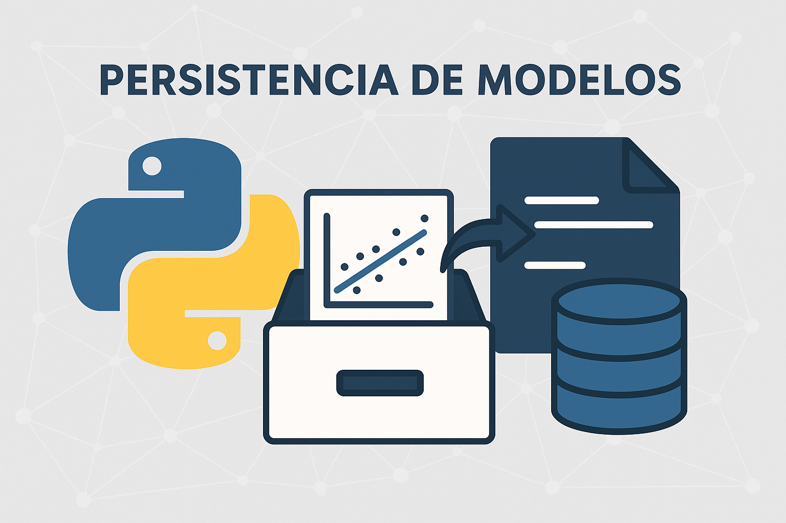

<h1 align = "center"> PERSISTENCIA DE MODELOS EN PYTHON </h1> 

<p align = "center">
  
</p>
<p align = "center">
  <a href = "https://github.com/sarapazr04">
    
  </a>
</p>

## ÍNDICE

1. **Conceptos Fundamentales:**  
   - Qué significa persistir objetos en Python  
   - Serialización y deserialización de modelos  
   - Persistencia en modelos de regresión lineal  

2. **Métodos de Persistencia:**  
   - `pickle`  
   - `joblib`  
   - `dill`  
   - `skops`  

3. **Prueba de Persistencia:**  
   - Ejemplo con código 
   - Comparación de resultados y tiempos  

4. **Guía de Implementación:**  
   - Pasos para guardar y cargar modelos  
   - Funciones `save_model()` y `load_model()`  

5. **Referencias y Recursos:**  

## 1. CONCEPTOS FUNDAMENTALES
### 1.1. ¿Qué significa persistir objetos en Python?

La **persistencia** en programación hace referencia a la capacidad de **guardar el estado de un objeto** para poder **recuperarlo más adelante** y continuar utilizándolo sin necesidad de volver a crearlo o entrenarlo.

En Python, este proceso se consigue mediante la **serialización**, que convierte el objeto en una secuencia de bytes que puede almacenarse en disco o transmitirse por red.

- **Definición formal:**  
> La persistencia es el proceso de **almacenar el estado de un objeto** en un formato que permita **reconstruirlo exactamente igual** en el futuro.

- **Ejemplo básico:**

```python
# Guardar una lista en un archivo con pickle
import pickle

data = [1, 2, 3, 4, 5]

# Serializar (guardar)
with open("datos.pkl", "wb") as f:
    pickle.dump(data, f)

# Deserializar (cargar)
with open("datos.pkl", "rb") as f:
    cargado = pickle.load(f)

print(cargado)   # [1, 2, 3, 4, 5]
```
>En este ejemplo, el objeto `data` se convierte en bytes y se guarda en el archivo `datos.pkl`.  
>Más tarde puede cargarse para recuperar su estado original, incluso después de reiniciar el programa.

### 1.2. Serialización y deserialización de modelos

La **serialización** convierte un objeto de Python (por ejemplo, un modelo de regresión) en un formato que puede almacenarse en un archivo `.pkl` o `.joblib`.

La **deserialización** es el proceso inverso: reconstruir el objeto a partir del archivo guardado.

---

#### Esquema general:
Modelo entrenado → Serialización → Archivo guardado (.pkl / .joblib)

Archivo guardado → Deserialización → Modelo recuperado

### 1.3. Persistencia en modelos de regresión lineal

Cuando entrenamos un modelo de **regresión lineal** (simple o múltiple), este aprende una serie de **parámetros internos** que describen la relación entre las variables de entrada y salida.

| Parámetro | Descripción |
|------------|--------------|
| `coef_` | Coeficientes (pendientes) asociados a cada variable independiente |
| `intercept_` | Término independiente o sesgo |
| `n_features_in_` | Número de variables de entrada |

Guardar el modelo consiste en **almacenar todos estos valores** para poder reproducir exactamente la función aprendida sin volver a entrenar.

---

#### - Ejemplo conceptual:

> Y = β₀ + β₁·X₁ + β₂·X₂ + … + βₙ·Xₙ

Si el modelo aprende:

> β₀ = 1.2,  β₁ = 0.8,  β₂ = 2.5

estos valores se guardan dentro del archivo serializado, garantizando que el modelo podrá volver a utilizarse en cualquier momento sin pérdida de información.

#### - Ventajas principales de la persistencia de modelos:

- **Ahorro de tiempo:** no es necesario reentrenar el modelo cada vez.  
- **Reutilización:** los modelos pueden usarse en otras aplicaciones o sistemas.  
- **Reproducibilidad:** los resultados se mantienen idénticos al entrenamiento original.  
- **Versionado:** permite guardar distintas versiones del mismo modelo entrenado.

## 2. MÉTODOS DE PERSISTENCIA

### 2.1. [pickle](https://docs.python.org/3/library/pickle.html)

> **Descripción:** Biblioteca estándar de Python para serializar y deserializar objetos.  
> Convierte cualquier objeto de Python en una secuencia de bytes para poder almacenarlo o transmitirlo.

- **Instalación:**
  
  `pickle` viene incluido en Python, **no requiere instalación adicional.**

- **Uso básico:**

    ```python
    import pickle

    # Guardar un objeto
    with open("modelo.pkl", "wb") as f:
        pickle.dump(modelo, f)

    # Cargar el objeto
    with open("modelo.pkl", "rb") as f:
        modelo_cargado = pickle.load(f)
    ```

- **Ventajas:**

    - Incluido por defecto en Python.
    - Muy fácil de usar.
    - Permite guardar casi cualquier tipo de objeto.
    - Ideal para proyectos pequeños o prototipos.

- **Desventajas:**

    - Archivos más grandes que otros métodos.
    - Más lento con grandes volúmenes de datos.
    - **Poco seguro**: cargar un archivo `pickle` desconocido puede ejecutar código malicioso.
    - No está optimizado para objetos de NumPy o modelos de `scikit-learn`.
- **Cuándo usar:**

    - Prototipos simples o educativos.
    - Casos donde la seguridad no es crítica.
    - Cuando se requiere una solución nativa sin dependencias externas.

### 2.2. [joblib](https://joblib.readthedocs.io/en/latest/)

> **Descripción:** Biblioteca optimizada para guardar objetos grandes, especialmente aquellos que contienen arrays NumPy (como los modelos de scikit-learn).

- **Instalación:**

    `pip install joblib`

- **Uso básico:**

    ``` python
    import joblib
    from sklearn.linear_model import LinearRegression

    # Entrenar y guardar el modelo
    modelo = LinearRegression().fit(X, y)
    joblib.dump(modelo, "modelo.joblib")

    # Cargar el modelo
    modelo_cargado = joblib.load("modelo.joblib") 
    ```

- **Ventajas:**
  - Mucho más eficiente que `pickle` para modelos de *scikit-learn*.  
  - Compresión integrada (`compress=3`).  
  - Ideal para grandes *datasets* o modelos complejos.  
  - Estándar de facto para persistencia en *machine learning*.

- **Desventajas:**
  - Necesita instalación adicional (`joblib`).  
  - No añade seguridad extra frente a `pickle` (misma advertencia).  
  - Ligera dependencia de versión de librerías.

- **Cuándo usar:**
  - **Modelos de regresión lineal** (simple o múltiple).  
  - Proyectos que utilicen *scikit-learn*.  
  - Cuando se requiere **eficiencia y portabilidad**.

### 2.3. [dill](https://pypi.org/project/dill/)

> **Descripción:** Extensión avanzada de `pickle` que permite serializar objetos que pickle no puede manejar (funciones, lambdas, cierres, etc.).

- **Instalación:**

    `pip install dill`

- **Uso básico:**

    ``` python
    import dill

    # Guardar un objeto complejo
    with open("modelo.dill", "wb") as f:
        dill.dump(modelo, f)

    # Cargarlo
    with open("modelo.dill", "rb") as f:
        modelo_cargado = dill.load(f)
    ```

- **Ventajas:**
  - Puede guardar objetos más complejos que pickle. 
  - Compatible con casi cualquier estructura de Python. 
  - Misma sintaxis que pickle.

- **Desventajas:**
  - Archivos más grandes. 
  - No mejora el rendimiento respecto a joblib. 
  - No está pensada específicamente para machine learning.

- **Cuándo usar:**
  - Cuando se necesitan guardar objetos complejos (funciones o clases personalizadas).
  - No recomendable para modelos de regresión lineal, salvo casos específicos.

### 2.4. [skops](https://skops.readthedocs.io/en/stable/)

> **Descripción:** Biblioteca moderna desarrollada por el equipo de *scikit-learn* para guardar modelos de forma **segura y reproducible**.  
> Usa un formato legible (*JSON + binarios*) que evita los riesgos de `pickle`.

- **Instalación:**

    `pip install skops`

- **Uso básico:**

    ``` python
    from skops.io import dump, load

    # Guardar el modelo
    dump(modelo, "modelo.skops")

    # Cargar el modelo
    modelo_cargado = load("modelo.skops")
    ```

- **Ventajas:**
  - Mayor seguridad (no ejecuta código al cargar).  
  - Archivos portables y legibles.  
  - Creada específicamente para modelos de *scikit-learn*.  
  - Evita problemas de compatibilidad entre versiones.

- **Desventajas:**
  - Más nueva y menos extendida.  
  - No soporta aún todos los tipos de objetos.  
  - Ligera curva de aprendizaje inicial.

- **Cuándo usar:**
  - Proyectos que requieran **persistencia segura y reproducible**.  
  - Escenarios donde el modelo vaya a compartirse o publicarse.  
  - Ideal para **trabajos académicos o producción segura**.

### Comparativa de los métodos de persistencia

| Método | Eficiencia (velocidad / tamaño) | Adecuado para regresión lineal | Compatibilidad y facilidad de uso |
|:--------|:---------------------------------|:--------------------------------|:----------------------------------|
| **pickle** | 🟡 Media – Archivos más grandes y lentos con arrays grandes | 🟡 Válido, pero no optimizado para `scikit-learn` | 🟢 Muy fácil (nativo en Python) |
| **joblib** | 🟢 Alta – Rápido y archivos más compactos (especialmente con `compress`) | 🟢 **Ideal** para modelos de `scikit-learn` y grandes datasets | 🟢 Sencillo y ampliamente usado en ML |
| **dill** | 🟡 Media – Similar a pickle, pero permite objetos más complejos | 🔴 Poco recomendable para regresión lineal (no optimiza arrays) | 🟡 Fácil de usar, pero menos común |
| **skops** | 🟢 Alta – Buen rendimiento y formato compacto en JSON/binario | 🟢 Muy adecuado, diseñado para `scikit-learn` | 🟡 Más reciente, requiere familiarización inicial |

> **Conclusión:**  
> - **`joblib`** es el método **más eficiente y adecuado** para guardar modelos de regresión lineal de *scikit-learn*.  
> - **`skops`** destaca como alternativa moderna y **más segura**, ideal si el modelo va a compartirse o publicarse.  
> - **`pickle`** es funcional pero menos eficiente.  
> - **`dill`** es útil solo cuando se requiere guardar objetos Python muy complejos.


## 3. PRUEBA DE PERSISTENCIA

### 3.1. Ejemplo con código (Regresión Lineal Múltiple)

 En este ejemplo realizaremos una **prueba básica de persistencia** para comprobar que un modelo de regresión lineal puede guardarse y cargarse correctamente sin perder su capacidad de predicción.  
 Usaremos un pequeño dataset sintético con dos variables independientes (`X₁`, `X₂`) y una dependiente (`y`).

```python
import numpy as np
from sklearn.linear_model import LinearRegression
import joblib

# 1. Crear datos simulados (regresión múltiple)
X = np.array([
    [1, 2],
    [2, 3],
    [3, 4],
    [4, 5],
    [5, 6]
])
y = np.array([5, 8, 11, 14, 17])  # y = 1 + 2*X1 + X2

# 2️. Entrenar modelo
modelo = LinearRegression()
modelo.fit(X, y)

# Mostrar parámetros aprendidos
print("Coeficientes (β₁, β₂):", modelo.coef_)
print("Intercepto (β₀):", modelo.intercept_)

# 3. Guardar el modelo (serialización)
joblib.dump(modelo, "modelo_persistente.joblib")

# 4. Cargar el modelo (deserialización)
modelo_cargado = joblib.load("modelo_persistente.joblib")

# 5. Verificar que el modelo funciona igual
X_nuevo = np.array([[6, 7]])
pred_original = modelo.predict(X_nuevo)
pred_cargado = modelo_cargado.predict(X_nuevo)

print("\nPredicción original:", pred_original)
print("Predicción tras cargar modelo:", pred_cargado)

# 6. Comprobación de equivalencia
assert np.allclose(pred_original, pred_cargado), "Error: los resultados no coinciden"
print("\n El modelo cargado produce las mismas predicciones que el original.")
```
### **Salida:**
```
Coeficientes (β₁, β₂): [1. 2.]
Intercepto (β₀): 1.0

Predicción original: [20.]
Predicción tras cargar modelo: [20.]

El modelo cargado produce las mismas predicciones que el original.
```

### **Interpretación de la prueba**

- **Entrenamiento:**  
  El modelo aprende una relación lineal entre las variables:  
  `y = 1 + 1·X₁ + 2·X₂`

- **Guardado y carga:**  
  El modelo se serializa con `joblib.dump()` y se recupera con `joblib.load()`.  
  Ambos objetos (el original y el cargado) producen **predicciones idénticas**, lo que demuestra que la persistencia fue exitosa.

- **Comprobación automática:**  
  La instrucción `assert np.allclose(pred_original, pred_cargado)` confirma que **no existe diferencia numérica** entre ambos resultados.

### **Comparación de métodos y tiempos**

Para comparar la eficiencia entre `pickle` y `joblib`, se puede añadir una pequeña medición de tiempo y tamaño del archivo:

```python
import time, os, pickle

# Guardar con pickle
t0 = time.perf_counter()
with open("modelo.pkl", "wb") as f:
    pickle.dump(modelo, f)
pickle_time = time.perf_counter() - t0
pickle_size = os.path.getsize("modelo.pkl")

# Guardar con joblib
t0 = time.perf_counter()
joblib.dump(modelo, "modelo.joblib", compress=3)
joblib_time = time.perf_counter() - t0
joblib_size = os.path.getsize("modelo.joblib")

print(f"\nTiempo pickle: {pickle_time:.6f}s, tamaño: {pickle_size/1024:.2f} KB")
print(f"Tiempo joblib: {joblib_time:.6f}s, tamaño: {joblib_size/1024:.2f} KB")
```

> **Resultado esperado:**  
> `joblib` suele generar **archivos más pequeños** y **guardar/cargar más rápido** que `pickle`, especialmente con modelos que contienen arrays de *NumPy* (como los coeficientes de una regresión).

---

### **Conclusión de la prueba**

- El modelo entrenado se guarda y recupera correctamente usando `joblib`.  
- Las predicciones antes y después del guardado son **idénticas**.  
- Se confirma que la **persistencia de modelos funciona correctamente** para la regresión lineal múltiple.  
- `joblib` se muestra como la opción **más eficiente y confiable** para esta tarea, cumpliendo así con los criterios de la historia de usuario.

## 4. GUÍA PARA IMPLEMENTAR EN LA APLICACIÓN

### 4.1. Pasos para guardar y cargar modelos

> En esta sección se documenta el **proceso completo** que el equipo debe seguir para **guardar y recuperar modelos de regresión lineal** dentro de la aplicación.  
> Los pasos son válidos tanto para modelos simples como múltiples entrenados con *scikit-learn*.

---

#### **1. Entrenar el modelo**

Primero se entrena el modelo con los datos seleccionados:

```python
from sklearn.linear_model import LinearRegression

X = [[1, 2], [2, 3], [3, 4], [4, 5]]
y = [5, 8, 11, 14]

modelo = LinearRegression().fit(X, y)
```

>El modelo aprende los coeficientes (`coef_`) y el intercepto (`intercept_`) que definen la función lineal de predicción.

#### **2. Guardar el modelo entrenado**

Una vez entrenado, el modelo debe guardarse para poder reutilizarlo posteriormente sin volver a entrenar.

El método recomendado es `joblib.`

```python
import joblib

# Guardar el modelo en un archivo
joblib.dump(modelo, "modelos/regresion_lineal.joblib")
```

> El archivo `.joblib` contiene todos los parámetros aprendidos del modelo, listos para recuperarse en otra sesión o equipo.

#### **3. Cargar el modelo guardado**

Para usar un modelo ya entrenado y guardado, basta con cargarlo desde el archivo:

```python
# Cargar el modelo desde disco
modelo_cargado = joblib.load("modelos/regresion_lineal.joblib")

# Verificar que funciona correctamente
print(modelo_cargado.predict([[5, 6]]))
```

>El modelo cargado conserva su comportamiento y predice de la misma manera que el original.
Esto permite mantener la consistencia del sistema incluso tras cerrar la aplicación.

#### **4. Verificación del proceso**

Se recomienda siempre comprobar que el modelo cargado produce las mismas predicciones que el original:

```python
import numpy as np

pred_original = modelo.predict([[5, 6]])
pred_cargado = modelo_cargado.predict([[5, 6]])

assert np.allclose(pred_original, pred_cargado), "Error: los modelos no coinciden"
```

>Si la comprobación es correcta, la persistencia de modelos está funcionando adecuadamente.

### 4.2. Propuesta de funciones `save_model()` y `load_model()`

A continuación se proponen dos funciones genéricas para integrar la persistencia de modelos dentro de la aplicación de regresión lineal.
Estas funciones permiten guardar y cargar cualquier modelo de manera uniforme y reutilizable por todo el equipo.

#### Función `save_model()`

```python
import joblib
from pathlib import Path
from datetime import datetime

def save_model(model, file_path="modelos/modelo.joblib", compress=3):
    """
    Guarda un modelo entrenado en un archivo .joblib.
    Parámetros:
        model: objeto del modelo entrenado (ej. LinearRegression)
        file_path: ruta donde se guardará el archivo
        compress: nivel de compresión (por defecto 3)
    """
    path = Path(file_path)
    path.parent.mkdir(parents=True, exist_ok=True)
    joblib.dump(model, path, compress=compress)
    
    print(f"Modelo guardado correctamente en {path}")
    print(f"Fecha: {datetime.now().strftime('%Y-%m-%d %H:%M:%S')}")
```

#### Función `load_model()`

```python
import joblib
from pathlib import Path

def load_model(file_path="modelos/modelo.joblib"):
    """
    Carga un modelo previamente guardado con joblib.
    Parámetros:
        file_path: ruta del archivo del modelo (.joblib)
    Retorna:
        model: objeto del modelo cargado listo para predecir
    """
    path = Path(file_path)
    if not path.exists():
        raise FileNotFoundError(f"❌ El archivo {file_path} no existe.")
    
    model = joblib.load(path)
    print(f"Modelo cargado correctamente desde {path}")
    return model
```

#### Ejemplo de uso conjunto:

```python
# Entrenar y guardar
modelo = LinearRegression().fit(X, y)
save_model(modelo, "modelos/regresion_multiple.joblib")

# Cargar el modelo más adelante
modelo_recuperado = load_model("modelos/regresion_multiple.joblib")

# Comprobar que funciona igual
print(modelo_recuperado.predict([[5, 6]]))
```

> Estas funciones facilitan la integración de la persistencia dentro de la interfaz gráfica o los flujos de backend del proyecto, asegurando un proceso estándar, rápido y reproducible para todo el equipo.

## 5. REFERENCIAS Y RECURSOS

### 5.1. Documentación Oficial

1. **pickle (Python Standard Library):**  
   - https://docs.python.org/3/library/pickle.html  
   - Módulo estándar para serialización y deserialización de objetos.

2. **joblib:**  
   - https://joblib.readthedocs.io/en/latest/  
   - Biblioteca optimizada para persistencia de modelos y arrays de NumPy.

3. **dill:**  
   - https://pypi.org/project/dill/  
   - Extensión de `pickle` para objetos complejos y funciones personalizadas.

4. **skops:**  
   - https://skops.readthedocs.io/en/stable/  
   - Proyecto del equipo de *scikit-learn* que permite guardar modelos de forma segura y reproducible.

5. **scikit-learn:**  
   - https://scikit-learn.org/stable/modules/model_persistence.html  
   - Guía oficial sobre cómo guardar y cargar modelos con `joblib` y `pickle`.

---

### 5.2. Tutoriales y Blogs Recomendados

1. **Real Python – Model Persistence with joblib and pickle**  
   - https://realpython.com/python-pickle-module/  
   - Explicación clara de cómo usar `pickle` y `joblib` para guardar modelos.

2. **Machine Learning Mastery – Save and Load Machine Learning Models in Python**  
   - https://machinelearningmastery.com/save-load-machine-learning-models-python-scikit-learn/  
   - Ejemplos prácticos de persistencia con `scikit-learn`.

3. **Towards Data Science – Safe Model Saving with skops**  
   - https://towardsdatascience.com/safely-saving-your-scikit-learn-models-with-skops-39d6486574b6  
   - Introducción al nuevo método de guardado seguro con `skops`.

4. **DataCamp – Serialization in Python**  
   - https://www.datacamp.com/tutorial/pickle-python-tutorial  
   - Tutorial paso a paso sobre serialización y persistencia en Python.

5. **StatQuest (YouTube)**  
   - https://www.youtube.com/c/joshstarmer  
   - Explicaciones visuales sobre modelos lineales y conceptos de machine learning.

---

### 5.3. Datasets de Práctica

1. **Scikit-learn Datasets:**  
   - Incluidos en la librería: `from sklearn import datasets`  
   - Ejemplos: `load_diabetes()`, `load_boston()`, `fetch_california_housing()`

2. **Kaggle Datasets:**  
   - https://www.kaggle.com/datasets  
   - Miles de datasets reales para probar modelos.

3. **UCI Machine Learning Repository:**  
   - https://archive.ics.uci.edu/ml/  
   - Datasets clásicos para regresión, clasificación y clustering.

---

### 5.4. Herramientas Útiles

1. **Jupyter Notebook**  
   - Ideal para desarrollar y probar modelos de forma interactiva.  
   - Instalación: `pip install jupyter`

2. **Google Colab**  
   - https://colab.research.google.com/  
   - Entorno online gratuito para ejecutar notebooks sin instalación local.

3. **Anaconda Distribution**  
   - https://www.anaconda.com/  
   - Incluye Python, Jupyter y las principales librerías científicas.

4. **Visual Studio Code**  
   - https://code.visualstudio.com/  
   - Editor recomendado para proyectos Python con soporte Markdown integrado.

---


